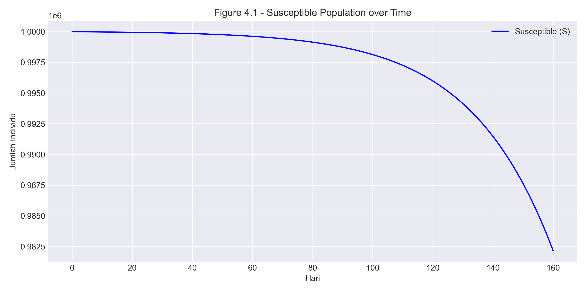
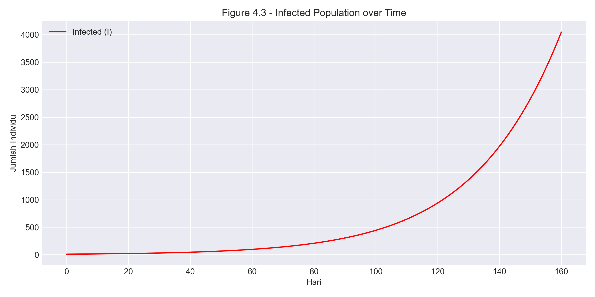
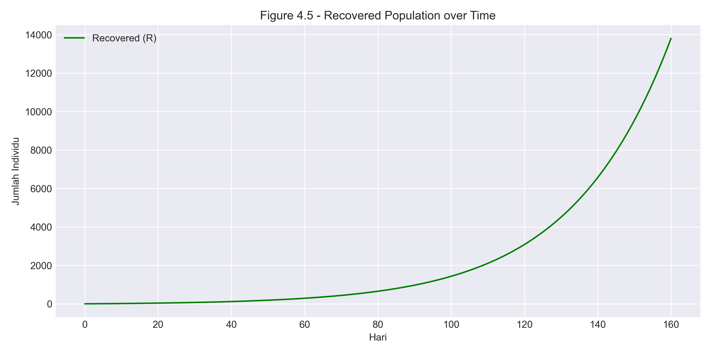
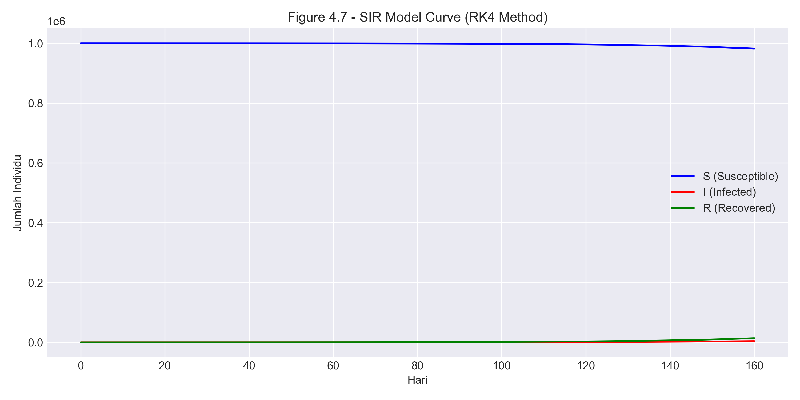
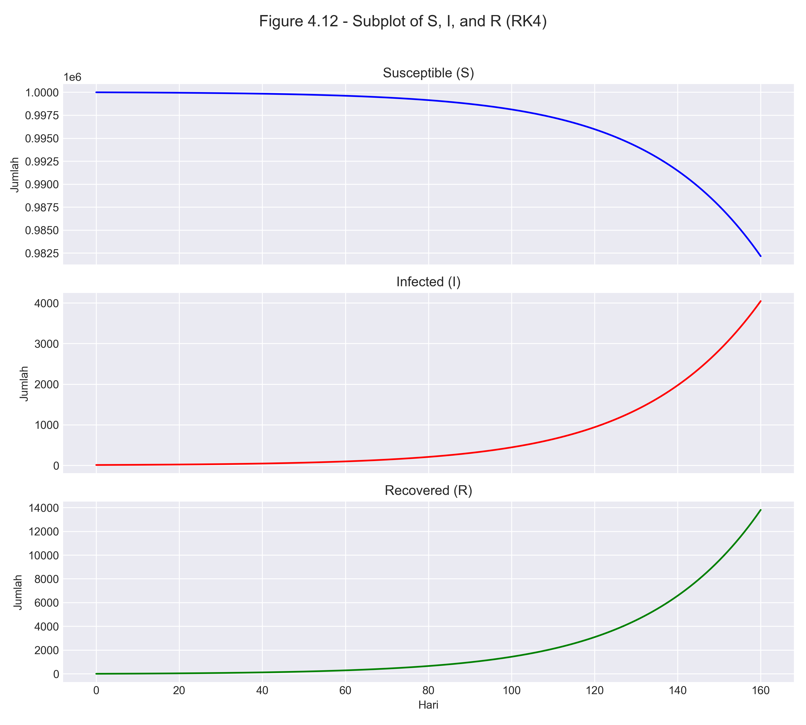

# Tugas Pemrograman B - Simulasi Model SIR Menggunakan Metode Runge-Kutta Orde 4

## Deskripsi Tugas

Tugas Pemrograman B untuk mata kuliah Komputasi Numerik ini bertujuan untuk mengimplementasikan model SIR (Susceptible-Infected-Recovered) menggunakan metode numerik Runge-Kutta orde 4. Implementasi ini digunakan untuk mensimulasikan penyebaran penyakit COVID-19 dalam suatu populasi dari waktu ke waktu.

## Anggota Kelompok 2

<!-- Isikan nama anggota kelompok di sini -->

1. Neyla Shakira (2306250655)
2. Laura Fawzia Sambowo (2306260145)
3. Grace Yunike Margaretha Sitorus (2306267031)
4. Putri Kiara Salsabila Arief (2306250743)

## Teori Model SIR

Model SIR adalah model kompartemen klasik dalam epidemiologi yang membagi populasi menjadi tiga kelompok:

- **S (Susceptible)**: Populasi yang rentan terinfeksi
- **I (Infected)**: Populasi yang terinfeksi dan dapat menularkan
- **R (Recovered/Removed)**: Populasi yang telah sembuh/kebal atau meninggal

Model SIR dinyatakan dalam sistem persamaan diferensial biasa (ODE):

1. dS/dt = -β·S·I
2. dI/dt = β·S·I - γ·I
3. dR/dt = γ·I

Dimana:

- S = jumlah individu rentan pada waktu t
- I = jumlah individu terinfeksi pada waktu t
- R = jumlah individu sembuh pada waktu t
- β = laju penularan (transmission rate)
- γ = laju pemulihan (recovery rate)

## Metode Runge-Kutta Orde 4

Untuk menyelesaikan sistem ODE dalam model SIR, kami menggunakan metode Runge-Kutta orde 4 (RK4). Metode RK4 adalah metode numerik dengan akurasi tinggi yang menggunakan pendekatan empat tahap untuk memperkirakan solusi persamaan diferensial.

Rumus iterasi RK4 untuk sistem ODE:

```
y_{n+1} = y_n + (1/6)·(k₁ + 2·k₂ + 2·k₃ + k₄)

Dimana:
k₁ = h·f(t_n, y_n)
k₂ = h·f(t_n + h/2, y_n + k₁/2)
k₃ = h·f(t_n + h/2, y_n + k₂/2)
k₄ = h·f(t_n + h, y_n + k₃)
```

## Implementasi Program

### File `sir_rk4.cpp`

Program utama yang mengimplementasikan metode RK4 untuk mensimulasikan model SIR. Parameter yang digunakan:

- β (beta) = 1.63 × 10^(-7) (laju penularan)
- γ (gamma) = 0.125 (laju pemulihan)
- Populasi total (N) = 1.000.000
- Jumlah awal terinfeksi = 10
- Durasi simulasi = 160 hari

Program menghasilkan file CSV berisi evolusi waktu dari jumlah S, I, dan R.

### File `plot_sir_full.py`

Program Python untuk memvisualisasikan hasil simulasi dari file CSV. Membuat 5 jenis grafik:

1. Grafik populasi rentan (S) terhadap waktu
2. Grafik populasi terinfeksi (I) terhadap waktu
3. Grafik populasi sembuh (R) terhadap waktu
4. Grafik gabungan S, I, R terhadap waktu
5. Subplot dari S, I, R untuk perbandingan

## Cara Menjalankan Program

### Menjalankan Simulasi Model SIR

1. Kompilasi program C++:
   ```
   g++ sir_rk4.cpp -o sir_rk4
   ```
   atau gunakan IDE yang sudah dilengkapi compiler C++.
2. Jalankan executable yang dihasilkan:
   ```
   ./sir_rk4
   ```
   Ini akan menghasilkan file `sir_output.csv`.

### Visualisasi Hasil

1. Pastikan Python dan pustaka yang dibutuhkan sudah terpasang:
   ```
   pip install pandas matplotlib
   ```
2. Jalankan script Python:
   ```
   python plot_sir_full.py
   ```
3. Lima file gambar akan dihasilkan:
   - figure_4_1_susceptible.png
   - figure_4_3_infected.png
   - figure_4_5_recovered.png
   - figure_4_7_sir_combined.png
   - figure_4_12_subplots.png

## Hasil Visualisasi

Berikut adalah hasil visualisasi dari simulasi model SIR yang telah dilakukan:

### 1. Grafik Populasi Susceptible (S)


_Gambar 1: Grafik populasi rentan (Susceptible) terhadap waktu menunjukkan penurunan jumlah individu yang rentan terinfeksi._

### 2. Grafik Populasi Infected (I)


_Gambar 2: Grafik populasi terinfeksi (Infected) terhadap waktu menunjukkan peningkatan jumlah individu yang terinfeksi._

### 3. Grafik Populasi Recovered (R)


_Gambar 3: Grafik populasi sembuh (Recovered) terhadap waktu menunjukkan peningkatan jumlah individu yang telah sembuh atau meninggal._

### 4. Grafik Gabungan Model SIR


_Gambar 4: Grafik gabungan model SIR menampilkan dinamika ketiga populasi (S, I, dan R) dalam satu visualisasi._

### 5. Subplot Populasi S, I, dan R


_Gambar 5: Subplot dari ketiga populasi (S, I, dan R) untuk memudahkan perbandingan antara ketiganya._

## Analisis Hasil

Simulasi menunjukkan evolusi penyebaran COVID-19 dalam populasi sesuai dengan model SIR menggunakan parameter yang diberikan. Dari hasil simulasi, dapat disimpulkan:

1. Dengan kondisi awal 10 orang terinfeksi dalam populasi 1 juta, jumlah infeksi meningkat secara bertahap seiring waktu.

2. Jumlah individu rentan (S) menurun seiring waktu, dari 999.990 menjadi sekitar 982.155 pada hari ke-160.

3. Jumlah individu terinfeksi (I) meningkat dari 10 mencapai sekitar 4.044 pada hari ke-160.

4. Jumlah individu sembuh (R) meningkat dari 0 menjadi sekitar 13.801 pada hari ke-160.

5. Berdasarkan nilai parameter yang digunakan, simulasi menunjukkan fase awal penyebaran, di mana puncak pandemi belum tercapai dalam periode simulasi 160 hari.

## Kesimpulan

Implementasi model SIR menggunakan metode Runge-Kutta orde 4 berhasil mensimulasikan penyebaran COVID-19 dalam suatu populasi. Hasil yang diperoleh menunjukkan bahwa metode RK4 efektif digunakan untuk menyelesaikan sistem persamaan diferensial dalam model epidemiologi.

Model ini dapat bermanfaat untuk memahami pola penyebaran COVID-19 dan dapat digunakan sebagai dasar analisis strategi pengendalian pandemi.
